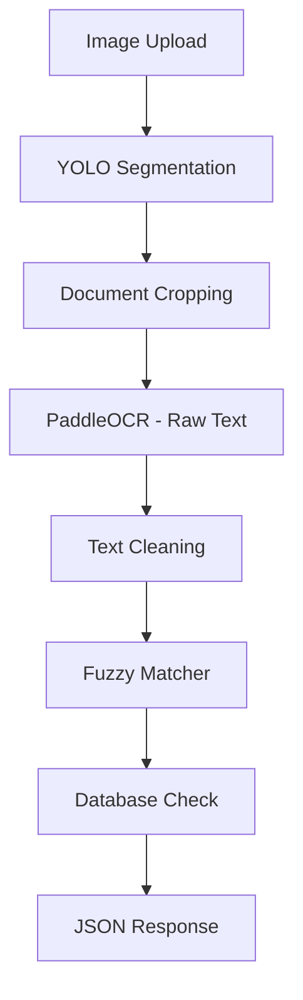

# Document Segmenter & Receipt Processor

This project uses a YOLOv11/v8 segmentation model to automatically detect and extract individual documents from a single image. After segmentation, documents (specifically receipts) are processed through an OCR pipeline for text extraction and verification.

## 🚀 Key Features

-   **AI-Powered Document Segmentation**: Utilizes YOLO for accurate document detection and cropping.
-   **Receipt Processing Pipeline**:
    -   **PaddleOCR**: Extracts raw text from document segments.
    -   **Text Cleaning**: Refines OCR output using regex and heuristics.
    -   **Fuzzy Matcher**: Matches extracted text against a database of known vendors and items.
    -   **Database Check**: Verifies findings against a mock database (`mock_db.json`).
-   **Modern Web UI**: React-based frontend for easy upload and visualization.
-   **Separate Environments**: Discrete environments for inference (`app/`) and training (`training/`).

## 🏛️ Pipeline Flow



## ✅ Prerequisites

-   **Python 3.12.3** (recommended for the `app` environment).
-   **Node.js v16+** and **npm**.
-   **Git**.

---

## ⚡ Quick Start

1.  **Clone the Repository**
    ```bash
    git clone https://github.com/DimitrievD/document-segmenter.git
    cd document-segmenter
    ```

2.  **Installation**
    Automatic setup of virtual environments (`venv_app`, `venv_training`) and dependencies.
    -   **Full App Setup (Windows):** `.\app\install_app.bat`
    -   **Full App Setup (Linux/macOS):** `cd app && chmod +x *.sh && ./install_app.sh`
    -   **Training Setup (Windows):** `.\training\install_training.bat`
    -   **Training Setup (Linux/macOS):** `cd training && chmod +x *.sh && ./install_training.sh`

3.  **Run the Application**
    Starts the Flask API and React frontend concurrently.
    -   **Windows:** `.\app\start_app.bat`
    -   **Linux/macOS:** `cd app && ./start_app.sh`

4.  **Access**
    -   **Frontend**: `http://localhost:3000`
    -   **Backend**: `http://localhost:5000`

---

## 📁 Project Structure

```
/document-segmenter
│
├── 📂 app/                        # Inference & API Logic
│   ├── 📜 app.py                  # Flask API Entry Point
│   ├── 📜 receipt_processor.py    # OCR & Processing Logic
│   ├── 📜 test_receipt.py        # Pipeline testing script
│   ├── 📜 install_app.bat / .sh   # App installation scripts
│   ├── 📜 start_app.bat / .sh     # App launch scripts
│   ├── 📂 database/               # Mock DB (json)
│   ├── 📂 models/                 # Inference weights
│   └── 📜 requirements.txt        # App-specific dependencies
│
├── 📂 training/                   # Training Environment
│   ├── 📜 train_segmentation.py   # Training script
│   ├── 📂 dataset/                # Training data
│   ├── 📜 install_training.bat/.sh # Training install scripts
│   ├── 📜 start_training.bat / .sh # Training launch scripts
│   └── 📜 requirements.txt        # Training-specific dependencies
│
├── 📂 document-processor-frontend/ # React Application
│
├── 📜 install.bat / .sh           # Installation scripts
└── 📜 start.bat / .sh             # Launch scripts
```

## 🛠️ Receipt Processing Verification
You can test the OCR pipeline standalone:
```bash
# Activate app environment
.\venv_app\Scripts\activate
# Run test script
python app/test_receipt.py test_images/1.jpg
```

---

## Troubleshooting
-   **Python Versions**: The `app` environment is optimized for Python 3.12. Ensure your global `python` command points to a compatible version during installation.
-   **PaddleOCR Dependencies**: PaddleOCR may require specific libraries depending on your OS (e.g., `libssl` on Linux).
-   **Web UI Connection**: If the UI shows errors, ensure the backend started on port 5000 and check for CORS issues in the console.
